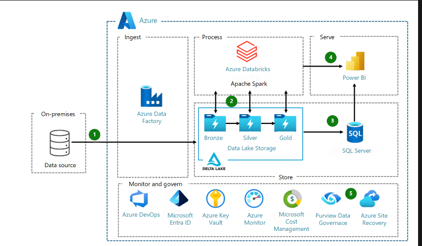
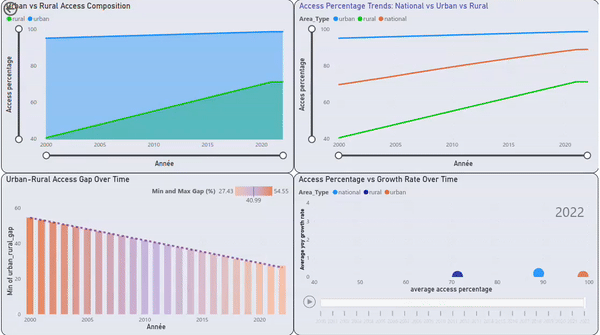
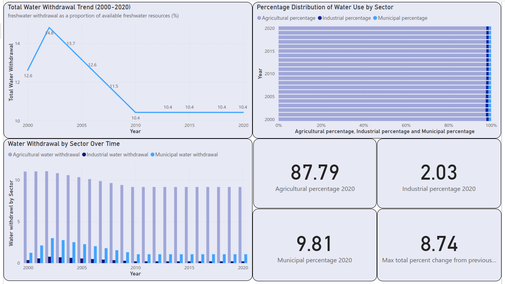

# Morocco National Water Consumption Analysis

## Project Overview
This project analyzes national water consumption data for Morocco using SDG6 (Sustainable Development Goal 6: Clean Water and Sanitation) data. It leverages Azure cloud services for data engineering, processing, and analysis, as well as Power BI for data visualization and insights.

## Data Source
Data is sourced from the SDG 6 Data Portal (https://sdg6data.org/). Usage of this data is subject to specific terms and conditions. Please see DATA_USAGE.md for detailed information on data usage rights and citation requirements.

## Project Architecture
This project follows an architecture very similar to the one shown in the image below: 

> [!NOTE]
> I'll make sure to provide a more accurate version soon.
> This is just the baseline of the project, and I plan to expand it further, so the architecture will evolve over time.

## Azure Services Used
- Azure Data Lake Storage Gen2 (ADLS Gen2): ADLS Gen2 is a highly scalable and secure data lake solution for big data analytics. It provides a hierarchical namespace that makes it easier to organize and manage data, and it supports Azure Blob storage features for cost-effective storage.

- Azure Databricks: Azure Databricks is a data analytics platform optimized for the Microsoft Azure cloud services platform. It provides a collaborative environment for big data processing and machine learning, using Apache Spark.

- Azure Data Factory: Azure Data Factory is a cloud-based data integration service that allows you to create data-driven workflows for orchestrating and automating data movement and data transformation. It's used in this project to manage and schedule data pipelines.

- Azure Key Vault: Azure Key Vault is a cloud service for securely storing and accessing secrets, such as API keys, passwords, certificates, and cryptographic keys. It's used in this project to manage sensitive information securely.

- Power BI: Power BI is a business analytics tool by Microsoft. It provides interactive visualizations and business intelligence capabilities with an interface simple enough for end users to create their own reports and dashboards. In this project, it's used for creating data visualizations and deriving insights.

## Visualizations and Insights

### Visualization 1: Water Access in Morocco

- Dashboard consisting of four charts that analyze water access trends in Morocco, comparing urban and rural areas over time.
### Key Findings
- The urban-rural water access gap in Morocco has been steadily narrowing since 2000, decreasing by 49.72% over a 22-year period. This significant reduction demonstrates substantial progress in equalizing water access across different regions of the country.
- Rural areas in Morocco experienced a dramatic improvement in water access, with the percentage of the rural population having access to water rising from 40.62% in 2000 to 71.33% in 2022. This 30.71 percentage point increase represents a transformative change in rural water infrastructure and availability over two decades.

### Visualization 2: Water Use

### Key Findings
**Declining Total Water Withdrawal**
   - Peak withdrawal: 14.8% of available freshwater resources (2000-2005)
   - Stabilized at 10.4% from 2010 onwards
   - Indicates improved water management and efficiency

**Agriculture Dominates Water Consumption**
   - Consistently accounts for over 80% of total water use
   - 2020 breakdown: Agriculture (87.79%), Municipal (9.81%), Industrial (2.03%)
   - Highlights critical role of agriculture in water resource planning

**Minimal Industrial Water Use**
   - Only 2.03% of total water consumption in 2020
   - Suggests potential for industrial growth with minimal water resource impact
**Stable Municipal Water Consumption**
   - Second largest category after agriculture
   - Remains relatively constant over the 20-year period
   - Indicates consistent urban water supply, with potential for efficiency improvements

## Acknowledgments
- SDG 6 Data Portal for providing the data
- Azure cloud services for data processing and analysis
- Power BI for data visualization

